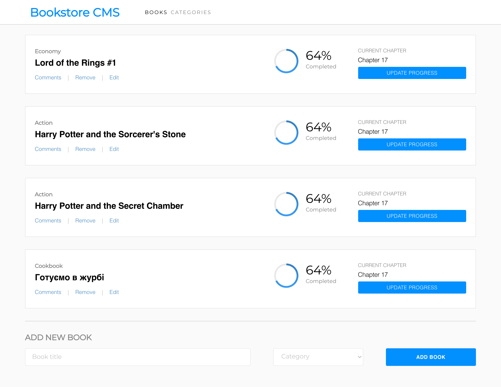

# Bookstore

In this web app you can:
- Display a list of books.
- Add a book.
- Remove a selected book.

## Built With

- Major languages: JavaScript
- Framework/Libraries: React
- Technologies/tools used:
  - create-react-app tool
  - Webpack
  - Babel
  - Jest
  - Git 
  - ESLint
  - Stylelint

## Using the project locally

- Install Git and Node.js
- Clone the project from GitHub
- Enter the project's folder in command line
- Run the following commands as listed in your terminal:
 - `npm install`
 - `npm start`
 - Open [http://localhost:3000](http://localhost:3000) to view it in your browser.

## 👤 Bohdan Shcherbak

- GitHub: [@akucintavalent](https://github.com/akucintavalent)
- Twitter: [@ibodi828](https://twitter.com/ibodi828)
- LinkedIn: [LinkedIn](https://www.linkedin.com/in/bohdan-shcherbak/)

## 🤝 Contributing

Contributions, issues, and feature requests are welcome!

Feel free to check the issues page.

## Show your support

Give a ⭐️ if you like this project!

## 📝 License

This project is [MIT](./MIT.md) licensed.
